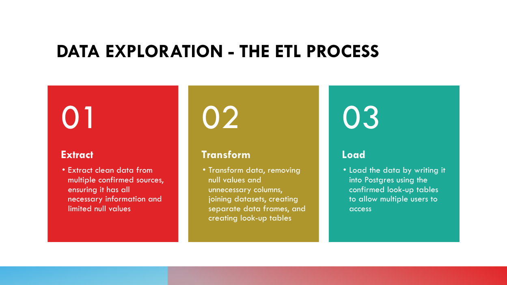
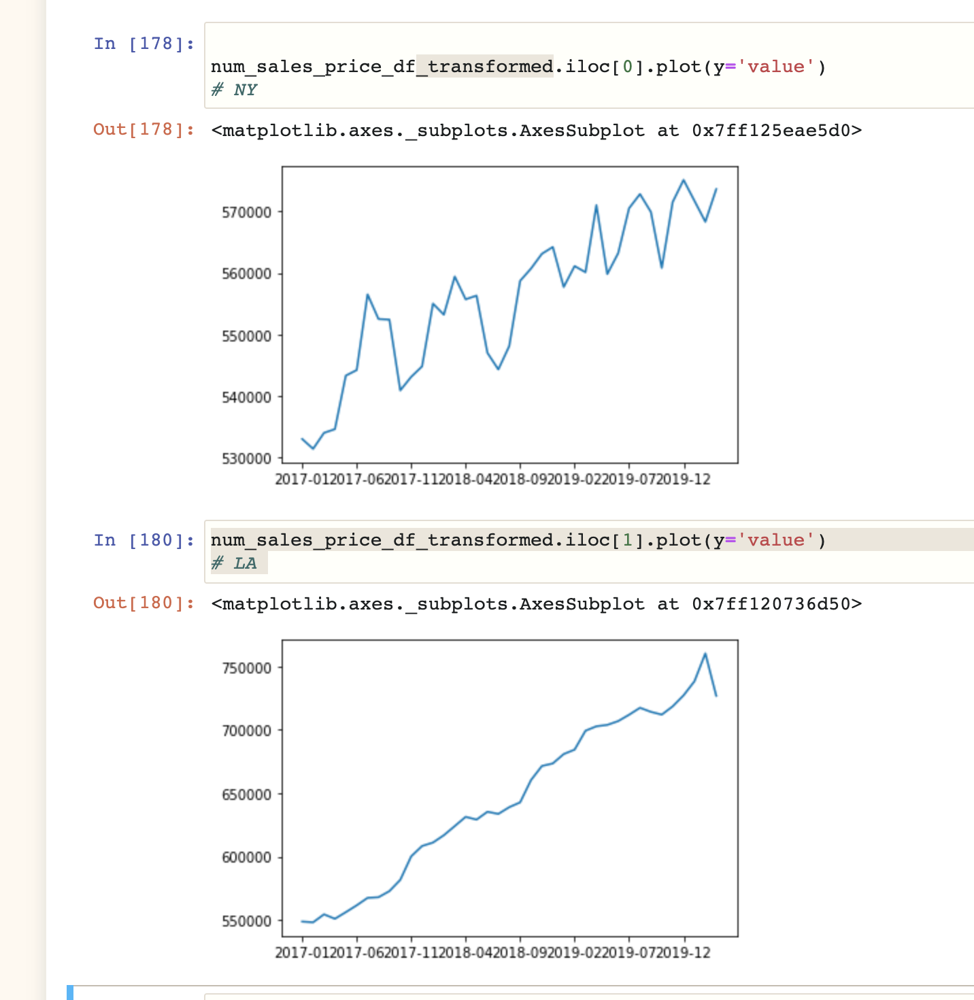
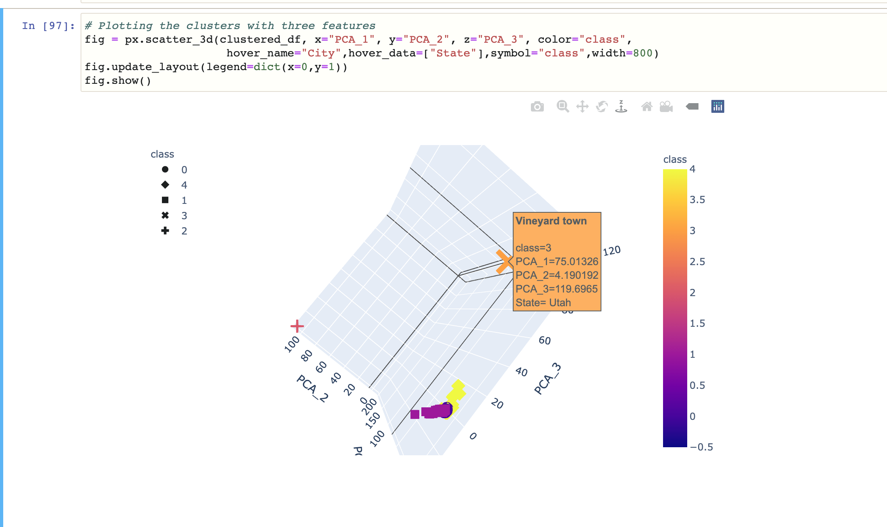
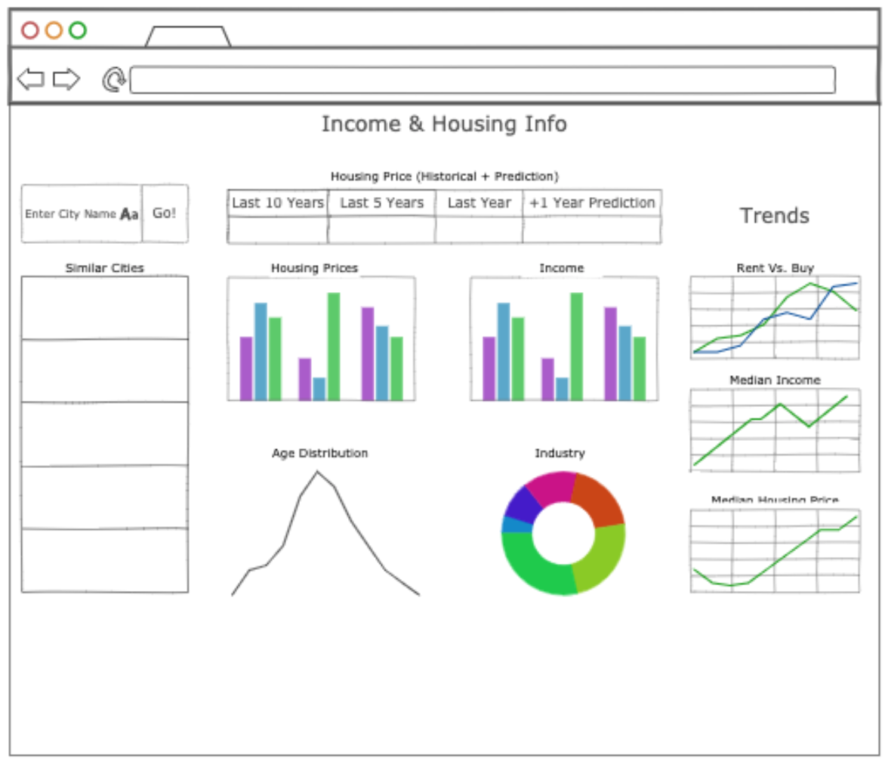

# Housing Trends in the Top 50 US Cities

UC Berkeley Extension Data Analytics Bootcamp Final Project

---

## This is the GitHub repository for our group's final project. 

### Group Members:

| Member               	| Role 	                 | Responsibilities                                                 |
|----------------------	|---------------------   | -------------                                                    |
| Markeia Brox-Chester  |  Project Manager    	 |  Manage the Project Presentation, Technology, and Communication  |
| Abigail Woolf      	|  Database Lead         |  Manage the Database and ETL Process                             |
| Robert Rustia        	|  Machine Learning Lead |  Manage the Machine Learning Model and Design 	                |
| Sathvik Aithala      	|  Dashboard Lead  	     |  Manage the GitHub Repository and Presentation Dashboard         |

While members are assigned specific roles, we all work together on each part of the project. 

---

## Selected Topic - Housing Trends

Overview: Housing prices in the United States (US) continue to increase as incomes rise, unemployment drops, and industries grow. Like many, our team wants to predict how housing prices will change over the years as we decide where we want to relocate long-term, which is why we selected this topic.

Objective: By analyzing housing market data and trends between 2015-2019, the Housing Price Prediction Tool will predict whether the housing market will rise or drop in the 50 largest cities in the US. For example, someone who works in the Technology sector will be able to compare the income, housing price, and population demographics of San Francisco, Austin, and Seattle while they are applying for jobs. This could help them better understand similarities and differences between different cities and aid their decision making process. 

## Questions we would like to answer are:

- Given the data available, can we expect housing prices to increase or decrease in the coming years?
    - *Using demographic, income, housing price, job industries, and rent/buy ratios in a city to help come to this prediction.
    
- For a given city, which other US cities have similar housing and demographic data?
    - *For example, if a person is working in the tech sector and is looking for a new city to move to, they will be able to see a list of cities similar to San Francisco or Austin that may not be as obvious.
    
- Given a city name, what pertinent information should be understood by someone looking to move to the area?
    - *Our dashboard would allow a user to see charts of demographic data, income data, housing prices, crime, and unemployment rates, and trends over time for each city. 

#### Locations of various project deliverables:

| Objective | Location |
|-----------|-----------|
|Presentation| [Google Slides](https://drive.google.com/file/d/10OQSpUDdGAvfv400hQJ3XEkmrohSWTQC/view?usp=sharing)|
|Exploratory Analysis code | GitHub Master Branch -  Zhvi_all_city.ipynb |
|Machine Learning code and output | GitHub Master Branch - Resources folder |
|Dashboard Wireframe | GitHub Master Branch - Images/Dashboard_Design.png|

#### Presentation:
Our presentation is hosted on Google Slides, and can be found [here](https://drive.google.com/file/d/10OQSpUDdGAvfv400hQJ3XEkmrohSWTQC/view?usp=sharing).

###### Technologies & Tools Used:

###### Data Exploration Phase:

###### Data Analysis Phase:
Detailed descriptions of our data analysis can be found in our [presentation](https://drive.google.com/file/d/10OQSpUDdGAvfv400hQJ3XEkmrohSWTQC/view?usp=sharing), on slide 7. 

Here are the housing price trends of New York (top) and Los Angeles (bottom), after we cleaned null values from our data. We found that the housing prices in Los Angeles to rise in a more linear and predictable fashion compared to New York, which was more sporadic.

- Looking at two cities, New York and Los Angeles, we found that housing prices have increased over the years, but not steadily for all cities.
- New York’s (top graph) housing market has large increases and decreases in shorter periods of time.
- Los Angeles’s (bottom graph) housing market shows small increases each year, but less decreases.
- When comparing this trend to unemployment rates, Los Angeles has consistently decreased, while New York has fluctuated.
- Preliminary Conclusion: Given the data for New York, it is possible some city housing markets may drop within the next few months, instead of assuming all will continue to rise. 

###### Data Sources:

[Kaggle: Zillow US House Price Data](https://www.kaggle.com/paultimothymooney/zillow-house-price-data)

[Census: US City and Town Population Totals: 2010-2019](https://www.census.gov/data/tables/time-series/demo/popest/2010s-total-cities-and-towns.html)

[Bureau of Labor Statistics - Unemployment Rates by City](https://www.bls.gov/lau/data.htm)

[Kaggle: MoveHub City Ranking Data](https://www.kaggle.com/blitzr/movehub-city-rankings)

#### Database:
- For our database, we will be using postgres by use of pgAdmin. The image below represents the tables of data that are uploaded onto the database. These relationships helped giude me in the creation of the tables on the database. Five tables were created to coincide with the five csv files we are using for our machine learning model. The postres.sql file is added to the main page of the master.

- The most common and obvious connect between all of our datasets is the City column. 

#### Machine Learning:

###### Preliminary Data Processing:
- The first steps were to check the kind of data types were inside of the CSV file housing our data for each city. We found that our dataset had city name, state, county and average sales price for all home types inside of that city with time steps of months from 2006 to 2020. 

- The next was to check for duplicates and null values in the dataframe we created. We chose to keep the first of each of the duplicates and drop all rows (cities) that had more than 10% null values. This left a little over 17,000 cities with data from the year 2016-2020.

In the first week, we were able to complete the initial unsupervised clustering. We attained the following 3D Pricincipal Cluster Analysis Plot from this data.

###### Preliminary Feature Engineering, Feature Selection, & Decision-making Process:
- For the null values we decided to use a KNN (K-Nearest-Neighbors) imputer to fill in the values, as a simple imputer would have used the mean or median housing price. For housing data with large variances between large cities like New York and small towns, we believed that nearest-neighbor medians would not skew the data as much as the median of the whole column. 

- With the 4 years of monthly time-step data for the remaining 17,000 cities, the categorical features of the state that the cities were in was ordinal-encoded, then one-hot-encoded, and finally added into the data frame to be used as a feature with the rest of the time series data. This brought the total number of columns  from 177 to 224. 

###### Splitting Data Into Testing & Training sets:
- We used cross-validation rather than the usual 3/4 train/test split with the CV using a 90/10 split. We then ran each of the ten blocks of data against the nine other parts sequentially. One major advantage of cross-validation is that the model is trained on a larger training set, which will hopefully improve performance. 

###### Explanation of Model Choice (Including Limitations & Benefits):
- We used RandomizedSearchCV to find a final mode from the Random Forest classifier model. From our results, the *best* model used 117 features, and used 4 n-estimators. 

- We then had the final model (selected from the CV) predict the y-values, and used the predictions to compare them to the labeled y. When we checked the Real Mean Square Error, we achieved a score of 8361. As our housing price data is in dollars ($), our predictions were, on average, within $10,000 of actual values!

###### Changes Made Throughout the Process:

#### Dashboard:

We plan to use *Tableau* to create and host our dashboard. It will be directly tied to our Postgres database hosted on AWS via a direct connection.

Here is the proposed layout for our dashboard. The storyboard is also visible in our [presentation](https://drive.google.com/file/d/10OQSpUDdGAvfv400hQJ3XEkmrohSWTQC/view?usp=sharing), on slides 15 through 18.

This design allows us to showcase the following skills we learned in class:

|Element|Skill|Description|
|-------|-----|-----------|
|City Input Drop-Down Menu|Interactive Dashboard Elements|The user will be able to select a city from a list of 50 US Cities.|
|Similar Cities List|Machine Learning - Clustering|A list of cities that fall within the same cluster as the selected city will be displayed here, with links to the city's website|
|Housing Price Table|Machine Learning - Prediction|The table will display historical pricing growth rates as well as a directional prediction for the future based on our machine learning regression model.|
|Charts and Graphs|Data Visualization|Displays data that is relevant to the selected city to help the user get a holistic picture of that city's housing, income, and demographic structure.|

Our dashboard can be found [here](), or embedded on this [website]() we have created to present our final project.

---
@Graders, please note that the communication protocols were removed after Segment 2 was submitted, just in case it is graded later than 10/11.

TO DO LIST FOR SEGMENT 3 (Notes taken 10/13):

- Abigail:
    - host database on cloud
    - confirm if both datasets we're using have the cities in the same order (same index)

- Markeia:
    - Presentation:
        - Technologies, languages, tools, and algorithms used throughout the project
        - discuss/update any changes to analysis/exploration process
        - start website for hosting tableau public embed link

- Robert:
    - Explanation of changes in model choice (if changes occurred between the Segment 2 and Segment 3 deliverables)
    - Description of how they have trained the model thus far, and any additional training that will take place
    - Description of current accuracy score
    - try new model (timestamp data-based) - get RMSE <8k
    - organize github repo folders
        - Images
        - Resources
        - ML
        - ETL
        - Database
        - Dashboard

- Sathvik:
    - Dashboard
        - Get Tableau dashboard started - done
        - connect to database - done
        - have at least the interactive element + initial images on dashboard
        - publish to Tableau public
        - Tableau Story - at least start blurbs for this
    - GitHub:
        - remove communication protocols - done
        - remove "week 1", "week 2", etc and rewrite cohesively - done
        - make sure outline looks good
        

